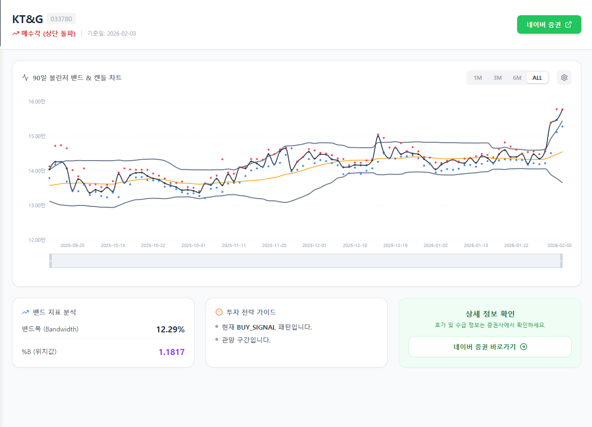
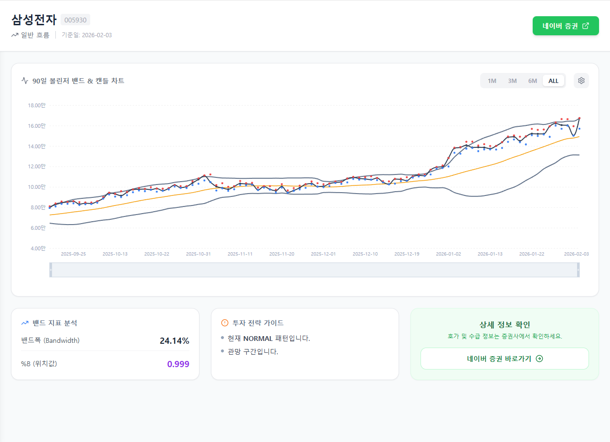
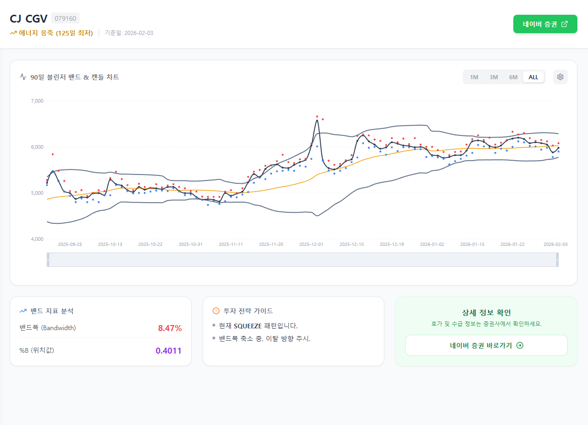

# MesuGak

MesuGak은 볼린저밴드 기반 매수 신호 분석해주는 서비스입니다.

## 핵심 기능

응축, 매수신호 분류
볼린저밴드 보조지표(%b,밴드폭 등) 기준으로 정렬

## 데이터 흐름

1. 분석 결과가 `stock_analysis` 컬렉션에 저장됨
2. 스케줄 함수가 `type == buy_signal` + `market == BOT_MARKET` 문서 조회
3. `pending_orders/{MARKET}_{CODE}` 문서로 upsert
4. 트레이딩/후속 처리 시스템이 `pending_orders`를 사용

## 프로젝트 구조

```text
mesugak/
  src/                               # 프론트엔드
  functions/
    index.js                         # Functions 엔트리
    end_of_day_buy_signals.js        # 장마감 스케줄 함수
    local_refresh_pending_orders.py  # 로컬 비상 갱신 스크립트
    legacy/                          # 구버전 보관
  firebase.json
  firestore.rules
```

## 스크린샷

### 상태 예시

**Buy Signal**



**Normal**



**Squeeze**



## 처음부터 Firebase 프로젝트 만들기

### 1) 사전 준비

- Node.js 20+ (권장: LTS)
- Python 3.10+ (로컬 fallback 스크립트용)
- Firebase CLI

```bash
npm install -g firebase-tools
firebase login
```

### 2) Firebase 프로젝트 생성

1. [Firebase Console](https://console.firebase.google.com/)에서 새 프로젝트 생성
2. Firestore Database 생성
3. Authentication에서 Google 로그인 활성화 (필요 시)
4. 프로젝트 설정에서 Web App 등록 후 Firebase 웹 설정값 확보
5. 서비스 계정 키(JSON) 발급

### 3) 로컬 프로젝트를 새 Firebase 프로젝트와 연결

```bash
firebase use --add
```

프롬프트에서 생성한 프로젝트를 선택하고 alias를 지정합니다.

### 4) 프론트엔드 Firebase 설정

`src/firebase.js`의 `firebaseConfig`를 본인 프로젝트 값으로 교체합니다.

### 5) Functions 환경변수 설정

`functions/.env` 파일을 만들고 최소 아래 값을 설정하세요.

```env
BOT_MARKET=KR
```

참고:
- 서비스 계정 키는 `functions/serviceAccountKey.json`에 두고, 절대 공개 저장소에 올리지 마세요.
- 이 저장소의 `.gitignore`는 민감정보를 제외하도록 설정되어 있습니다.

### 6) 의존성 설치

```bash
npm install
cd functions
npm install
cd ..
```

## 배포

### Firestore 규칙/인덱스

```bash
firebase deploy --only firestore
```

### Functions 배포

```bash
firebase deploy --only functions:refreshPendingOrdersFromBuySignals
```

### Hosting 배포

```bash
npm run build
firebase deploy --only hosting
```

## 로컬 비상 갱신 (Python)

Cloud Functions 스케줄이 실패한 경우 아래 명령으로 동일 로직을 수동 실행할 수 있습니다.

### 1) Python 가상환경 준비

```bash
python -m venv .venv
.venv\Scripts\pip install firebase-admin python-dotenv
```

### 2) 드라이런

```bash
.venv\Scripts\python functions/local_refresh_pending_orders.py --dry-run
```

### 3) 실제 반영

```bash
.venv\Scripts\python functions/local_refresh_pending_orders.py
```

### 4) 마켓 지정

```bash
.venv\Scripts\python functions/local_refresh_pending_orders.py --market US
```

## 운영 체크

- Functions 로그 확인
  - `firebase functions:log --only refreshPendingOrdersFromBuySignals`
- 특정 날짜 반영 확인
  - Firestore `pending_orders`에서 `date`, `updatedAt`, `status` 확인
- 장애 대비
  - `functions/local_refresh_pending_orders.py`로 즉시 수동 반영

## 라이선스

내부/개인 사용 기준으로 운영 중이며, 필요 시 별도 라이선스 정책을 추가하세요.
